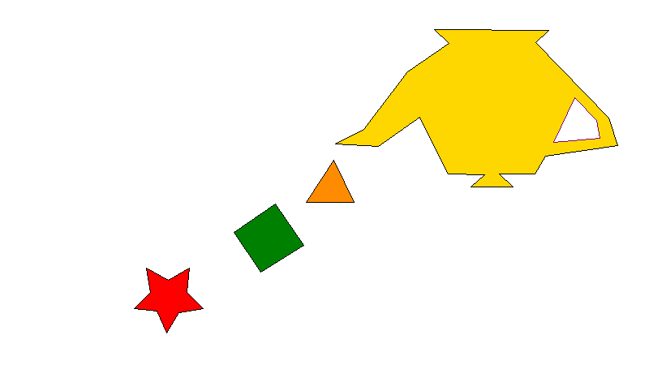

# lab1-graficas

Laboratorio de gráficas por computadora: un algoritmo de **relleno de polígonos por scanline** (barrido de líneas), escrito desde cero en Rust — sin usar ninguna función de relleno de una librería externa.



## Qué resuelve

Rellenar polígonos de más de 4 puntos (incluyendo cóncavos) y respetar un agujero interno que no debe pintarse. Se dibujan 5 polígonos sobre un lienzo de 800x450:

| Polígono | Puntos | Relleno | Línea |
|---|---|---|---|
| 1 | 10 | 🔴 rojo | negra |
| 2 | 4 | 🟢 verde | negra |
| 3 | 3 | 🟠 naranja | negra |
| 4 | 18 | 🟡 amarillo | negra |
| 5 (agujero de 4) | 4 | *sin relleno* | morada |

El polígono 5 está definido dentro del polígono 4 y se trata como un **agujero**: su interior nunca se pinta, aunque sí se dibuja su contorno.

El resultado se guarda como [`out.png`](out.png) y [`out.bmp`](out.bmp) en la raíz del proyecto.

## Algoritmo

Implementado a mano en [`src/main.rs`](src/main.rs). La única dependencia externa es el crate [`image`](https://docs.rs/image), usado únicamente para crear el buffer de píxeles en memoria y codificar el PNG final — **no** para rellenar ni dibujar figuras.

### 1. Relleno — scanline fill con regla par-impar

Para cada polígono:

1. Se construye una **tabla de aristas**: por cada segmento no horizontal se guarda su rango vertical `[y_min, y_max)`, la `x` donde cruza `y_min` y la pendiente inversa `dx/dy`.
2. Para cada línea de barrido `y` dentro del rango del polígono, se calculan las intersecciones `x` de todas las aristas activas en esa `y` y se ordenan.
3. Se rellenan los píxeles entre pares consecutivos de intersecciones `(x0, x1), (x2, x3), ...` — la clásica regla **par-impar (even-odd)**.

Para el **polígono 4 con su agujero (polígono 5)**, las aristas de ambos contornos se combinan en la misma tabla antes de barrer. Como la regla par-impar simplemente alterna dentro/fuera en cada cruce, el interior del agujero queda automáticamente sin pintar, sin necesidad de lógica especial.

### 2. Contorno — algoritmo de Bresenham

Cada arista de cada polígono se dibuja con el algoritmo de línea de Bresenham, encima del relleno, para que el borde quede nítido y cubra cualquier píxel de sobrante en el límite del relleno.

## Estructura del proyecto

```
src/main.rs     # algoritmo de scanline fill + Bresenham + definición de los 5 polígonos
Cargo.toml      # dependencia: image (solo buffer de píxeles + encoding PNG/BMP)
out.png         # imagen generada, incluida en el repo
out.bmp         # misma imagen en formato BMP, incluida en el repo
```

## Cómo correrlo

Requiere Rust y Cargo instalados ([rustup.rs](https://rustup.rs)).

```
cargo run --release
```

Esto genera/actualiza `out.png` y `out.bmp` en la raíz del proyecto.
